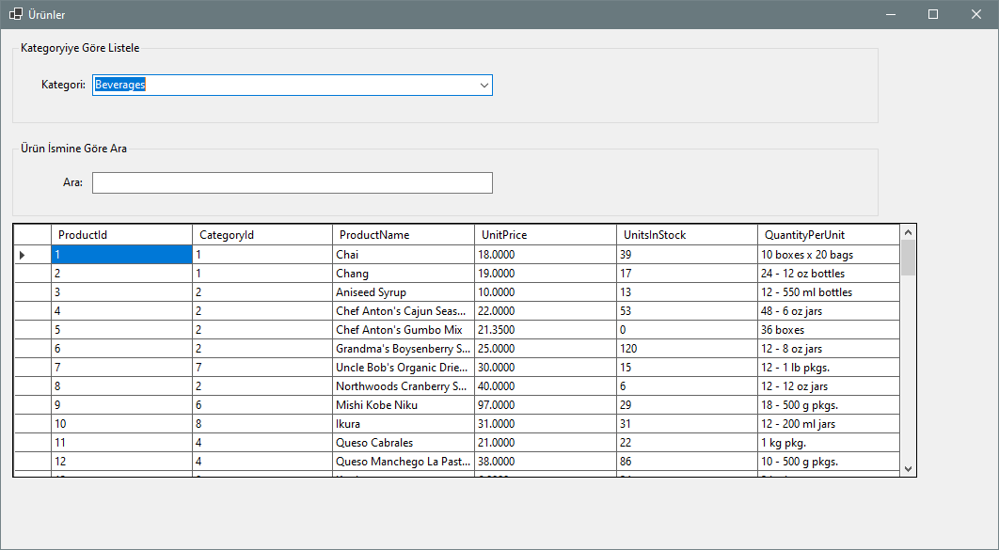

# .NET Course Recap Application

## Overview
This application is designed as a recap tool for a .NET Course, facilitating a practical understanding of the concepts learned during the course. It utilizes the Microsoft Northwind sample database to display products, allowing users to filter products based on category and search through product names.

## Features

- **Product Display:** Shows all products from the Northwind database in a grid view.
- **Category Filtering:** Allows users to filter products by selecting a specific category.
- **Search Functionality:** Users can search for products by their names.

## Prerequisites

Before running this application, make sure you have the following installed:
- .NET Framework 4.7.2 or later
- SQL Server (any version compatible with the Northwind database)

## Getting Started

### Setting up the Database

1. **Northwind Database:** This application requires the Northwind sample database to be installed on SQL Server. If you do not have the database installed, you can download it from [Microsoft's official repository](https://github.com/Microsoft/sql-server-samples/tree/master/samples/databases/northwind-pubs).

2. Once downloaded, restore the database using SQL Server Management Studio (SSMS). Instructions for restoring a database can be found [here]([https://docs.microsoft.com/en-us/sql/relational-databases/databases/restore-a-database-to-a-new-location-sql-server](https://learn.microsoft.com/en-us/sql/relational-databases/backup-restore/restore-a-database-to-a-new-location-sql-server?view=sql-server-ver16)).

### Running the Application

1. Clone this repository to your local machine.
2. Open the solution file in Visual Studio.
3. Build the solution.
4. Run the application by pressing `F5` or clicking the "Start" button in Visual Studio.

## Usage

- **To filter products by category:** Select a category from the dropdown at the top of the application window. The product list will automatically update to show only products from the selected category.
- **To search for a product:** Enter the product name in the search box. The product list will update in real-time as you type.

## Contributing

Contributions are welcome, especially from my classmates who wish to expand on this project or use it for their own learning. Please fork this repository and submit a pull request if you have features or improvements to add.

## License

This project is licensed under the MIT License - see the [LICENSE.md](LICENSE) file for details.

## Acknowledgments

- This project uses the Northwind sample database provided by Microsoft.
